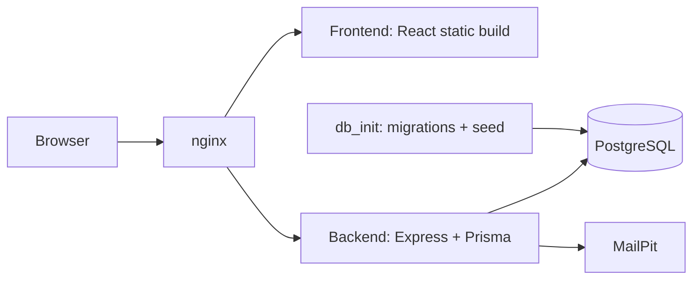

# Application Architecture

## 1. Overview

SIGECO is a local Docker Compose application with a React frontend, an Express backend, a PostgreSQL database, and an nginx reverse proxy in front of both.

The stack is designed for local development and demo use. Docker Compose starts the main services, applies database migrations and seed data, and exposes the app through a single entry point on port `80`.

---

## 2. Main Components

- `frontend`
  Builds the React app and serves the generated static files on port `3000` inside Docker.

- `backend`
  Runs the Express API on port `4000`, serves uploaded files under `/uploads`, and connects to PostgreSQL through Prisma.

- `db`
  PostgreSQL 15 database used by the backend for users, communities, memberships, requests, sessions, and related data.

- `db_init`
  One-shot setup container that waits for PostgreSQL, then runs Prisma migrations and seed data before the backend starts.

- `nginx`
  Public entry point of the stack. It routes `/` to the frontend and `/api` plus `/uploads` to the backend.

- `mailpit`
  Local SMTP test service used for email flows such as password reset. It also exposes a small web UI to inspect sent emails.

---

## 3. How Things Connect

- Docker Compose creates a shared internal network for all services.
- `nginx` is the only service exposed as the main web entry point on `http://localhost`.
- `frontend` and `backend` communicate through nginx rather than through a browser-visible direct backend port.
- `backend` connects to `db` using `DATABASE_URL`.
- `backend` sends local email through `mailpit` on SMTP port `1025`.
- `db_init` must complete successfully before `backend` starts.

Main request flow:

- Browser -> `nginx` -> `frontend`
- Browser -> `nginx` -> `backend` -> `db`
- Backend -> `mailpit` for development email delivery

---

## 4. Access Points

- Frontend
  `http://localhost`

- API
  `http://localhost/api`

- Health endpoint
  `http://localhost/api/health`

- Uploaded files
  `http://localhost/uploads/...`

- MailPit UI
  `http://localhost:8025`

- PostgreSQL from host
  `localhost:5432`

- Prisma Studio
  Not started automatically. It can be launched manually when needed.

---

## 5. Storage & Persistence

- PostgreSQL data is persisted in the Docker volume `db_data`.
- Backend uploaded files are stored in the Docker volume `backend_storage`.
- The backend source is bind-mounted into the container for local development.
- Seeded avatar assets are copied into runtime storage on startup if they are missing.

---

## 6. Architecture Diagram

---

## 7. Notes

- The backend currently exposes these implemented API areas: `auth`, `users`, `help`, `communities`, and `requests`.
- Session auth is cookie-based, so frontend requests must include credentials.
- nginx also forwards `/uploads` to the backend so public file URLs stay on the same host as the app.
