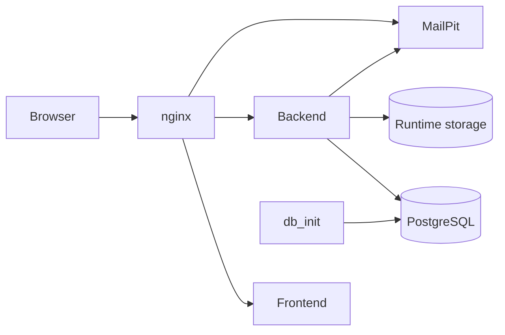

# Application Architecture

SIGECO is a Docker Compose application composed of a React frontend, an Express backend, a PostgreSQL database, and an nginx reverse proxy. The stack is designed for local development, academic review, and functional testing through a single public entry point.

## System Overview

The application is organised into five runtime services:

- `frontend`: builds and serves the React application on the internal Docker network
- `backend`: exposes the HTTP API, serves uploaded assets, and applies business rules
- `db`: PostgreSQL 15 database used by all backend modules through Prisma
- `mailpit`: local SMTP sink and inbox UI for development email flows
- `nginx`: reverse proxy and public entry point for web traffic

In addition, the stack includes a one-shot `db_init` service. It waits for PostgreSQL, applies Prisma migrations, and runs the seed before the backend becomes available.

## Request Flow

nginx is the only public HTTP entry point in the default setup.

- `http://localhost/` routes to the frontend
- `http://localhost/api/` routes to the backend API
- `http://localhost/uploads/` routes to backend-managed uploaded files
- `http://localhost/mail/` routes to the MailPit web interface

The browser never connects directly to the backend container in the default workflow. All web traffic passes through nginx.

## Backend Structure

The backend follows a layered structure:

- routes define the HTTP surface
- controllers map requests to use cases
- services apply business rules and orchestration
- repositories execute Prisma queries
- shared logic lives under `src/lib`

The current API surface covers authentication, users, communities, help, requests, members, calendar, reservations, voting, forum, news, incidents, and documents.

The backend also serves a health endpoint at `/api/health` and publishes runtime files from `storage/uploads` under `/uploads`.

## Persistence and Storage

The database schema is defined in `backend/prisma/schema.prisma` and accessed exclusively through Prisma Client.

Two persistence layers are used at runtime:

- PostgreSQL for relational data
- filesystem storage for uploaded files and seeded binary assets

The main Docker volumes are:

- `db_data` for PostgreSQL data
- `backend_storage` for uploaded files and seeded runtime assets
- `backend_node_modules` for backend dependencies inside Docker

On startup, the backend runs a small bootstrap step that copies seeded assets into runtime storage when required.

## Deployment Model in Local Development

The local environment is coordinated through `docker-compose.yml`:

- `db` exposes PostgreSQL on `localhost:5432`
- `db_init` runs `npm run db:deploy` and `npm run db:seed`
- `backend` waits for `db_init` to complete successfully
- `frontend` and `backend` expose only internal container ports
- `nginx` publishes port `80` to the host

Health checks are defined for the database, backend, frontend, and nginx to make startup order and local diagnostics more predictable.

## External Integrations

The architecture intentionally keeps integrations minimal:

- email is delivered to MailPit in local environments
- uploaded files are stored locally rather than in external object storage
- authentication is session-based and relies on HTTP cookies

These choices keep the runtime simple while preserving the same application boundaries used by the backend code.

## Architecture Diagram

