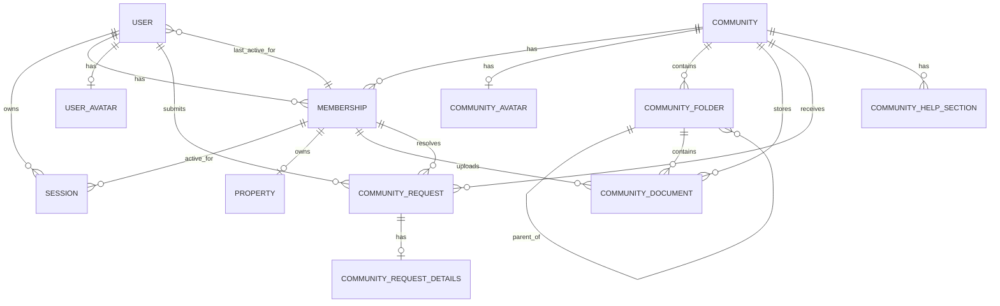

# Database

This project uses a single PostgreSQL database managed through Prisma. Most backend modules follow the same pattern: controllers call services, services apply business rules, and repositories execute Prisma queries against the database.

At the moment, the schema already covers users, communities, memberships, requests, help content, sessions, avatars, and the document storage tree used by future modules.

---

## 1. Overview

- Database: PostgreSQL
- ORM: Prisma (`prisma` and `@prisma/client`)
- Architecture: one database, one Prisma datasource
- Default schema in local setup: `public`
- File binaries are stored on disk under `storage/uploads/...`; the database stores metadata and storage paths

---

## 2. Tooling & Configuration

### Runtime and local setup

| Item | Value |
|---|---|
| Database container | `postgres:15-alpine` |
| Main connection variable | `DATABASE_URL` |
| Postgres bootstrap variables | `POSTGRES_USER`, `POSTGRES_PASSWORD`, `POSTGRES_DB` |
| Prisma client bootstrap | `new PrismaClient()` shared as a singleton |

Local example:

```env
DATABASE_URL=postgresql://postgres:postgres@db:5432/appdb?schema=public
```

### Prisma commands

| Script | Command | Purpose |
|---|---|---|
| `db:push` | `prisma db push` | Push schema changes without a migration |
| `db:migrate` | `prisma migrate dev` | Create and apply development migrations |
| `db:deploy` | `prisma migrate deploy` | Apply existing migrations |
| `db:seed` | `prisma db seed` | Load demo data |
| `db:reset` | `prisma migrate reset --force && prisma db seed` | Recreate and reseed the database |
| `prisma:generate` | `prisma generate` | Regenerate the Prisma client |
| `prisma:studio` | `prisma studio` | Open Prisma Studio |

### Docker flow

- `db` runs PostgreSQL
- `db_init` applies migrations and seed data
- `backend` waits for `db_init` to finish successfully before starting

Current migration folders:

- `20260321_initial_schema`
- `20260323_remove_membership_is_suspended`

---

## 3. Data Model

### Enums

| Enum | Values |
|---|---|
| `MembershipRole` | `MEMBER`, `VICE_PRESIDENT`, `PRESIDENT` |
| `CommunityRequestType` | `JOIN`, `UPDATE_INFO` |
| `CommunityRequestStatus` | `PENDING`, `APPROVED`, `REJECTED`, `CANCELLED` |

### `users`

| Field | Type | Notes |
|---|---|---|
| `id` | `uuid` | Primary key |
| `first_name` | `text` | Required |
| `last_name` | `text` | Required |
| `email` | `varchar(320)` | Required, unique |
| `phone` | `varchar(20)` | Nullable, unique |
| `password_hash` | `text` | Required |
| `password_changed_at` | `timestamp(3)` | Required, default `CURRENT_TIMESTAMP` |
| `last_active_membership_id` | `uuid` | Nullable FK -> `memberships.id` |
| `created_at` | `timestamp(3)` | Required, default `CURRENT_TIMESTAMP` |
| `updated_at` | `timestamp(3)` | Required |
| `deleted_at` | `timestamp(3)` | Nullable soft-delete marker |

Main relationships:

- one user can have many sessions
- one user can have many memberships
- one user can have many community requests
- one user can have one avatar
- one user can point to one last active membership

### `sessions`

| Field | Type | Notes |
|---|---|---|
| `id` | `uuid` | Primary key |
| `user_id` | `uuid` | Required FK -> `users.id` |
| `active_membership_id` | `uuid` | Nullable FK -> `memberships.id` |
| `created_at` | `timestamp(3)` | Required, default `CURRENT_TIMESTAMP` |
| `expires_at` | `timestamp(3)` | Required |
| `invalidated_at` | `timestamp(3)` | Nullable invalidation marker |

### `communities`

| Field | Type | Notes |
|---|---|---|
| `id` | `uuid` | Primary key |
| `name` | `varchar(160)` | Required |
| `cif` | `varchar(20)` | Required, unique |
| `country` | `varchar(100)` | Required |
| `province` | `varchar(120)` | Required |
| `municipality` | `varchar(120)` | Required |
| `street_type` | `varchar(50)` | Required |
| `street_name` | `varchar(255)` | Required |
| `postal_code` | `varchar(10)` | Required |
| `street_number_km` | `varchar(30)` | Required |
| `access_code` | `varchar(20)` | Required, unique |
| `storage_quota_bytes` | `bigint` | Required, default `5368709120` |
| `storage_used_bytes` | `bigint` | Required, default `0` |
| `created_at` | `timestamp(3)` | Required, default `CURRENT_TIMESTAMP` |
| `updated_at` | `timestamp(3)` | Required |
| `deleted_at` | `timestamp(3)` | Nullable soft-delete marker |

Main relationships:

- one community can have many memberships
- one community can have many requests
- one community can have many help sections
- one community can have many folders and documents
- one community can have one avatar

### `user_avatars`

| Field | Type | Notes |
|---|---|---|
| `id` | `uuid` | Primary key |
| `user_id` | `uuid` | Required, unique FK -> `users.id` |
| `storage_path` | `text` | Required, unique |
| `mime_type` | `varchar(100)` | Required |
| `size_bytes` | `integer` | Required |
| `created_at` | `timestamp(3)` | Required, default `CURRENT_TIMESTAMP` |
| `updated_at` | `timestamp(3)` | Required |

### `community_avatars`

| Field | Type | Notes |
|---|---|---|
| `id` | `uuid` | Primary key |
| `community_id` | `uuid` | Required, unique FK -> `communities.id` |
| `storage_path` | `text` | Required, unique |
| `mime_type` | `varchar(100)` | Required |
| `size_bytes` | `integer` | Required |
| `created_at` | `timestamp(3)` | Required, default `CURRENT_TIMESTAMP` |
| `updated_at` | `timestamp(3)` | Required |

### `memberships`

| Field | Type | Notes |
|---|---|---|
| `id` | `uuid` | Primary key |
| `user_id` | `uuid` | Required FK -> `users.id` |
| `community_id` | `uuid` | Required FK -> `communities.id` |
| `role` | `MembershipRole` | Required, default `MEMBER` |
| `alias` | `varchar(120)` | Required |
| `suspended_at` | `timestamp(3)` | Nullable |
| `suspended_until` | `timestamp(3)` | Nullable |
| `suspension_reason` | `text` | Nullable |
| `joined_at` | `timestamp(3)` | Required, default `CURRENT_TIMESTAMP` |
| `ended_at` | `timestamp(3)` | Nullable |
| `end_reason` | `text` | Nullable |
| `created_at` | `timestamp(3)` | Required, default `CURRENT_TIMESTAMP` |
| `updated_at` | `timestamp(3)` | Required |
| `deleted_at` | `timestamp(3)` | Nullable soft-delete marker |

Important constraints:

- unique per user and community: (`user_id`, `community_id`)
- a membership can be referenced by sessions as active context
- a membership can be referenced by users as last active community

### `properties`

| Field | Type | Notes |
|---|---|---|
| `id` | `uuid` | Primary key |
| `membership_id` | `uuid` | Required, unique FK -> `memberships.id` |
| `label` | `varchar(120)` | Required |
| `country` | `varchar(100)` | Required |
| `province` | `varchar(120)` | Required |
| `municipality` | `varchar(120)` | Required |
| `street_type` | `varchar(50)` | Required |
| `street_name` | `varchar(255)` | Required |
| `postal_code` | `varchar(20)` | Required |
| `street_number_km` | `varchar(30)` | Required |
| `block` | `varchar(30)` | Nullable |
| `floor` | `varchar(30)` | Nullable |
| `door` | `varchar(30)` | Nullable |
| `created_at` | `timestamp(3)` | Required, default `CURRENT_TIMESTAMP` |
| `updated_at` | `timestamp(3)` | Required |
| `deleted_at` | `timestamp(3)` | Nullable soft-delete marker |

### `community_requests`

| Field | Type | Notes |
|---|---|---|
| `id` | `uuid` | Primary key |
| `community_id` | `uuid` | Required FK -> `communities.id` |
| `user_id` | `uuid` | Required FK -> `users.id` |
| `type` | `CommunityRequestType` | Required |
| `status` | `CommunityRequestStatus` | Required, default `PENDING` |
| `request_comment` | `text` | Nullable |
| `resolution_message` | `text` | Nullable |
| `resolved_by_membership_id` | `uuid` | Nullable FK -> `memberships.id` |
| `resolved_at` | `timestamp(3)` | Nullable |
| `cancelled_at` | `timestamp(3)` | Nullable |
| `archived_at` | `timestamp(3)` | Nullable |
| `created_at` | `timestamp(3)` | Required, default `CURRENT_TIMESTAMP` |
| `updated_at` | `timestamp(3)` | Required |

### `community_request_details`

| Field | Type | Notes |
|---|---|---|
| `id` | `uuid` | Primary key |
| `community_request_id` | `uuid` | Required, unique FK -> `community_requests.id` |
| `proposed_alias` | `varchar(120)` | Nullable |
| `label` | `varchar(120)` | Required |
| `country` | `varchar(100)` | Required |
| `province` | `varchar(120)` | Required |
| `municipality` | `varchar(120)` | Required |
| `street_type` | `varchar(50)` | Required |
| `street_name` | `varchar(255)` | Required |
| `postal_code` | `varchar(20)` | Required |
| `street_number_km` | `varchar(30)` | Required |
| `block` | `varchar(30)` | Nullable |
| `floor` | `varchar(30)` | Nullable |
| `door` | `varchar(30)` | Nullable |
| `created_at` | `timestamp(3)` | Required, default `CURRENT_TIMESTAMP` |
| `updated_at` | `timestamp(3)` | Required |

### `community_help_sections`

| Field | Type | Notes |
|---|---|---|
| `id` | `uuid` | Primary key |
| `community_id` | `uuid` | Required FK -> `communities.id` |
| `title` | `varchar(160)` | Required |
| `description` | `text` | Required |
| `sort_order` | `integer` | Required, default `0` |
| `created_at` | `timestamp(3)` | Required, default `CURRENT_TIMESTAMP` |
| `updated_at` | `timestamp(3)` | Required |
| `deleted_at` | `timestamp(3)` | Nullable soft-delete marker |

### `community_folders`

| Field | Type | Notes |
|---|---|---|
| `id` | `uuid` | Primary key |
| `community_id` | `uuid` | Required FK -> `communities.id` |
| `parent_id` | `uuid` | Nullable self-FK -> `community_folders.id` |
| `name` | `varchar(255)` | Required |
| `created_at` | `timestamp(3)` | Required, default `CURRENT_TIMESTAMP` |
| `updated_at` | `timestamp(3)` | Required |
| `deleted_at` | `timestamp(3)` | Nullable soft-delete marker |

Important note:

- active sibling name conflicts are enforced by the backend service layer

### `community_documents`

| Field | Type | Notes |
|---|---|---|
| `id` | `uuid` | Primary key |
| `community_id` | `uuid` | Required FK -> `communities.id` |
| `folder_id` | `uuid` | Nullable FK -> `community_folders.id` |
| `uploaded_by_membership_id` | `uuid` | Nullable FK -> `memberships.id` |
| `name` | `varchar(255)` | Required display name |
| `description` | `text` | Nullable |
| `original_filename` | `varchar(255)` | Required uploaded filename |
| `storage_path` | `text` | Required, unique |
| `mime_type` | `varchar(100)` | Required |
| `extension` | `varchar(20)` | Nullable |
| `size_bytes` | `bigint` | Required |
| `created_at` | `timestamp(3)` | Required, default `CURRENT_TIMESTAMP` |
| `updated_at` | `timestamp(3)` | Required |
| `deleted_at` | `timestamp(3)` | Nullable soft-delete marker |

---

## 4. Relationships

The core of the schema is the `memberships` table.

- `users` and `communities` are linked through `memberships`
- each `membership` has one `property`
- `sessions` belong to `users` and can optionally point to the active `membership`
- `community_requests` belong to both a `user` and a `community`
- `community_request_details` extends a request with property-style information
- `community_help_sections` belong to a community
- `community_folders` build a self-referencing tree inside a community
- `community_documents` belong to a community and may optionally belong to a folder and reference the membership that uploaded them
- `user_avatars` and `community_avatars` are one-to-one metadata tables

Cardinality summary:

- `User` 1:N `Session`
- `User` 1:N `Membership`
- `Community` 1:N `Membership`
- `User` N:N `Community` through `Membership`
- `Membership` 1:1 `Property`
- `User` 1:1 `UserAvatar`
- `Community` 1:1 `CommunityAvatar`
- `Community` 1:N `CommunityRequest`
- `User` 1:N `CommunityRequest`
- `CommunityRequest` 1:1 `CommunityRequestDetails`
- `Community` 1:N `CommunityHelpSection`
- `Community` 1:N `CommunityFolder`
- `CommunityFolder` 1:N `CommunityFolder`
- `CommunityFolder` 1:N `CommunityDocument`
- `Community` 1:N `CommunityDocument`

---

## 5. ER Diagram



---

## 6. Seed Data

The local seed loads a small but useful demo dataset.

Shared demo password:

```text
Sigeco-2026!
```

### Seeded communities

| Community | Notes |
|---|---|
| `Comunidad SIGECO` | Has avatar, members, pending `UPDATE_INFO` request and 3 help sections |
| `Comunidad SIGECO Norte` | Has members, an approved `JOIN` request and 2 help sections |

### Seeded users

| Email | Name | Main seeded context |
|---|---|---|
| `nocommunity@ucm.es` | Sebastián SinComunidad | Registered user with no community, avatar and active session |
| `member@ucm.es` | Marta Miembro | `MEMBER` in Comunidad SIGECO, property 2A, pending `UPDATE_INFO` request |
| `vice@ucm.es` | Verónica Vicepresidente | `VICE_PRESIDENT` in Comunidad SIGECO |
| `president@ucm.es` | Pablo Presidente | `PRESIDENT` in Comunidad SIGECO |
| `suspended@ucm.es` | Sara Suspendida | Suspended `MEMBER` in Comunidad SIGECO |
| `double@ucm.es` | Diego Doble | `MEMBER` in Comunidad SIGECO and `PRESIDENT` in Comunidad SIGECO Norte |
| `access@ucm.es` | Marcos Miembro | `MEMBER` in Comunidad SIGECO Norte after an approved `JOIN` request |

### Why these records matter

- they cover all current auth actor types
- they are useful for testing multi-community context switching
- they include both pending and approved community-request flows
- they include seeded help content and avatar metadata

---

## 7. Usage Patterns

### Repository pattern

- repositories import the shared Prisma client from `backend/src/lib/prisma.js`
- services coordinate business rules and call repositories
- controllers usually stay thin and do not query Prisma directly

### Transactions

Prisma transactions are used when one action affects several records at once. Current examples include:

- changing the active membership context
- replacing avatars
- deleting an account
- deleting a community
- approving or rejecting requests

### Soft deletes and lifecycle fields

The schema uses timestamp fields to model lifecycle instead of hard deletes in many places:

- `deleted_at`
- `ended_at`
- `invalidated_at`
- `resolved_at`
- `cancelled_at`
- `archived_at`

In practice, repository queries often filter by `deletedAt: null`, `endedAt: null` or `invalidatedAt: null`.

### Files and metadata

- avatars and documents store metadata in PostgreSQL
- actual files are stored on disk
- the database keeps `storage_path`, `mime_type` and `size_bytes`
- backend responses convert stored paths into public URLs such as `/uploads/...`

---

## 8. Constraints and Practical Notes

### Main unique constraints

- `users.email`
- `users.phone`
- `communities.cif`
- `communities.access_code`
- `user_avatars.user_id`
- `user_avatars.storage_path`
- `community_avatars.community_id`
- `community_avatars.storage_path`
- `memberships (user_id, community_id)`
- `properties.membership_id`
- `community_request_details.community_request_id`
- `community_folders (community_id, parent_id, deleted_at)`
- `community_documents (community_id, folder_id, deleted_at, created_at)`
- `community_documents.storage_path`

### Indexing visible in the schema

Indexes exist for the usual lookup and lifecycle fields, including:

- foreign keys
- `deleted_at`
- `ended_at`
- `invalidated_at`
- `expires_at`
- request `status`
- request `type`
- help-section ordering

### Current model conventions worth knowing

- soft deletion is part of the data model, especially for users, communities, memberships, properties, help sections and documents
- suspension no longer depends on a boolean column; the current model uses `suspended_at` and `suspended_until`
- account deletion and community deletion are coordinated state changes, not simple row removals
- document and folder tables already exist in the schema even though their API module is still pending
