# Database

SIGECO uses a single PostgreSQL database accessed through Prisma. The schema under [`backend/prisma/schema.prisma`](../../backend/prisma/schema.prisma) is the source of truth for persistence, while Prisma Client is the only database access layer used by the backend.

## Overview

- Database engine: PostgreSQL
- ORM and client: Prisma (`prisma` and `@prisma/client`)
- Runtime model: one datasource, one application database, one Prisma schema
- Binary files: stored on disk under `storage/`; the database stores metadata and logical references only

In the local Docker setup, the `db` service provides PostgreSQL and `db_init` applies migrations and seed data before the backend starts serving requests.

## Functional Domains

The current schema covers the following backend domains:

- Identity and access: users, sessions, user avatars, active membership context
- Communities: communities, community avatars, memberships, properties
- Request flows: join requests and profile update requests
- Shared content: help sections, document folders and community documents
- Scheduling: calendar events, reservation spaces and bookings
- Participation: polls, poll options, votes, forum posts, comments and likes
- Community activity: news and incidents

## Persistence Conventions

Several conventions are used consistently across the schema:

- Soft deletion: many domain tables expose `deleted_at` instead of hard-deleting rows immediately
- Session lifecycle: sessions remain auditable through `expires_at` and `invalidated_at`
- Community context: users and sessions can both point to an active membership
- Storage integration: avatars, document files and images store `storage_path`, `mime_type` and size metadata
- Calendar projections: automatic events keep a reference to their source entity through `source_entity_id` and `source_occurrence_key`

These rules are part of the application contract and are relied upon by multiple backend modules.

## Tooling

The backend exposes the following Prisma scripts:

| Script | Purpose |
|---|---|
| `npm run db:migrate` | Create and apply a development migration |
| `npm run db:deploy` | Apply existing migrations |
| `npm run db:seed` | Load demo data |
| `npm run db:reset` | Recreate the database from migrations |
| `npm run prisma:generate` | Regenerate Prisma Client |
| `npm run prisma:studio` | Open Prisma Studio |

Migration files live under [`backend/prisma/migrations`](../../backend/prisma/migrations), and the seed entry point is [`backend/prisma/seed.js`](../../backend/prisma/seed.js).

## Entity-Relationship Model

The diagram below was generated from the current Prisma schema using `prisma-markdown`. It reflects the model as defined in `backend/prisma/schema.prisma`.

```mermaid
erDiagram
"users" {
  String id PK
  String first_name
  String last_name
  String email UK
  String phone UK "nullable"
  String password_hash
  DateTime password_changed_at
  String last_active_membership_id FK "nullable"
  DateTime created_at
  DateTime updated_at
  DateTime deleted_at "nullable"
}
"user_avatars" {
  String id PK
  String user_id FK,UK
  String storage_path UK
  String mime_type
  Int size_bytes
  DateTime created_at
  DateTime updated_at
}
"sessions" {
  String id PK
  String user_id FK
  String active_membership_id FK "nullable"
  DateTime created_at
  DateTime expires_at
  DateTime invalidated_at "nullable"
}
"communities" {
  String id PK
  String name
  String cif UK
  String country
  String province
  String municipality
  String street_type
  String street_name
  String postal_code
  String street_number_km
  String access_code UK
  BigInt storage_quota_bytes
  BigInt storage_used_bytes
  DateTime created_at
  DateTime updated_at
  DateTime deleted_at "nullable"
}
"community_avatars" {
  String id PK
  String community_id FK,UK
  String storage_path UK
  String mime_type
  Int size_bytes
  DateTime created_at
  DateTime updated_at
}
"memberships" {
  String id PK
  String user_id FK
  String community_id FK
  MembershipRole role
  String alias
  DateTime suspended_at "nullable"
  DateTime suspended_until "nullable"
  String suspension_reason "nullable"
  DateTime joined_at
  DateTime ended_at "nullable"
  String end_reason "nullable"
  DateTime created_at
  DateTime updated_at
  DateTime deleted_at "nullable"
}
"properties" {
  String id PK
  String membership_id FK,UK
  String label
  String country
  String province
  String municipality
  String street_type
  String street_name
  String postal_code
  String street_number_km
  String block "nullable"
  String floor "nullable"
  String door "nullable"
  DateTime created_at
  DateTime updated_at
  DateTime deleted_at "nullable"
}
"community_requests" {
  String id PK
  String community_id FK
  String user_id FK
  CommunityRequestType type
  CommunityRequestStatus status
  String request_comment "nullable"
  String resolution_message "nullable"
  String resolved_by_membership_id FK "nullable"
  DateTime resolved_at "nullable"
  DateTime cancelled_at "nullable"
  DateTime archived_at "nullable"
  DateTime created_at
  DateTime updated_at
}
"community_request_details" {
  String id PK
  String community_request_id FK,UK
  String proposed_alias "nullable"
  String label
  String country
  String province
  String municipality
  String street_type
  String street_name
  String postal_code
  String street_number_km
  String block "nullable"
  String floor "nullable"
  String door "nullable"
  DateTime created_at
  DateTime updated_at
}
"community_help_sections" {
  String id PK
  String community_id FK
  String title
  String description
  Int sort_order
  DateTime created_at
  DateTime updated_at
  DateTime deleted_at "nullable"
}
"community_folders" {
  String id PK
  String community_id FK
  String parent_id FK "nullable"
  String name
  DateTime created_at
  DateTime updated_at
  DateTime deleted_at "nullable"
}
"community_documents" {
  String id PK
  String community_id FK
  String folder_id FK "nullable"
  String uploaded_by_membership_id FK "nullable"
  String name
  String description "nullable"
  String original_filename
  String storage_path UK
  String mime_type
  String extension "nullable"
  BigInt size_bytes
  DateTime created_at
  DateTime updated_at
  DateTime deleted_at "nullable"
}
"calendar_events" {
  String id PK
  String community_id FK
  String owner_membership_id FK "nullable"
  CalendarEventType type
  String source_entity_id "nullable"
  String source_occurrence_key "nullable"
  String title
  DateTime event_date
  String start_time
  String end_time
  DateTime created_at
  DateTime updated_at
  DateTime deleted_at "nullable"
}
"reservation_spaces" {
  String id PK
  String community_id FK
  String name
  String description "nullable"
  String color_hex
  Boolean is_active
  Int total_capacity
  ReservationSpaceOccupancyMode occupancy_mode
  Int max_seats_per_booking "nullable"
  Boolean monday_enabled
  Boolean tuesday_enabled
  Boolean wednesday_enabled
  Boolean thursday_enabled
  Boolean friday_enabled
  Boolean saturday_enabled
  Boolean sunday_enabled
  String opening_time
  String closing_time
  Int slot_minutes
  Int max_consecutive_slots
  Int min_advance_minutes
  Int max_advance_days
  Int cancellation_notice_minutes
  DateTime created_at
  DateTime updated_at
  DateTime deleted_at "nullable"
}
"reservation_bookings" {
  String id PK
  String community_id FK
  String space_id FK
  String owner_membership_id FK
  ReservationBookingStatus status
  DateTime booking_date
  Int start_slot_index
  Int slot_count
  String start_time
  String end_time
  Int requested_seats
  DateTime cancelled_at "nullable"
  String cancelled_by_membership_id FK "nullable"
  String cancellation_reason "nullable"
  DateTime created_at
  DateTime updated_at
}
"polls" {
  String id PK
  String community_id FK
  PollKind kind
  String title
  String description "nullable"
  DateTime starts_at
  DateTime ends_at "nullable"
  String created_by_membership_id FK
  DateTime closed_at "nullable"
  String closed_by_membership_id FK "nullable"
  DateTime created_at
  DateTime updated_at
  DateTime deleted_at "nullable"
}
"poll_options" {
  String id PK
  String poll_id FK
  String title
  Int sort_order
  DateTime created_at
}
"poll_votes" {
  String id PK
  String poll_id FK
  String option_id FK
  String membership_id FK
  DateTime created_at
}
"forum_posts" {
  String id PK
  String community_id FK
  String author_membership_id FK "nullable"
  String poll_id FK,UK "nullable"
  String title
  String description
  ForumCategory category
  Boolean pinned
  DateTime edited_at "nullable"
  Boolean is_deleted
  DateTime last_activity_at
  DateTime created_at
  DateTime updated_at
}
"forum_comments" {
  String id PK
  String post_id FK
  String author_membership_id FK "nullable"
  String content
  DateTime edited_at "nullable"
  Boolean is_deleted
  DateTime created_at
  DateTime updated_at
}
"forum_post_likes" {
  String id PK
  String post_id FK
  String membership_id FK
  DateTime created_at
}
"forum_comment_likes" {
  String id PK
  String comment_id FK
  String membership_id FK
  DateTime created_at
}
"community_news" {
  String id PK
  String community_id FK
  String author_membership_id FK "nullable"
  String title
  String description
  String image_storage_path "nullable"
  String image_mime_type "nullable"
  Int image_size_bytes "nullable"
  DateTime event_starts_at "nullable"
  DateTime event_ends_at "nullable"
  DateTime edited_at "nullable"
  DateTime created_at
  DateTime updated_at
  DateTime deleted_at "nullable"
}
"community_incidents" {
  String id PK
  String community_id FK
  String author_membership_id FK "nullable"
  String title
  String description
  CommunityIncidentStatus status
  String image_storage_path "nullable"
  String image_mime_type "nullable"
  Int image_size_bytes "nullable"
  DateTime edited_at "nullable"
  DateTime created_at
  DateTime updated_at
  DateTime deleted_at "nullable"
}
"_MembershipToUser" {
  String A FK
  String B FK
}
"users" }o--o| "memberships" : lastActiveMembership
"user_avatars" |o--|| "users" : user
"sessions" }o--|| "users" : user
"sessions" }o--o| "memberships" : activeMembership
"community_avatars" |o--|| "communities" : community
"memberships" }o--|| "users" : user
"memberships" }o--|| "communities" : community
"properties" |o--|| "memberships" : membership
"community_requests" }o--|| "communities" : community
"community_requests" }o--|| "users" : user
"community_requests" }o--o| "memberships" : resolvedByMembership
"community_request_details" |o--|| "community_requests" : communityRequest
"community_help_sections" }o--|| "communities" : community
"community_folders" }o--|| "communities" : community
"community_folders" }o--o| "community_folders" : parent
"community_documents" }o--|| "communities" : community
"community_documents" }o--o| "community_folders" : folder
"community_documents" }o--o| "memberships" : uploadedByMembership
"calendar_events" }o--|| "communities" : community
"calendar_events" }o--o| "memberships" : ownerMembership
"reservation_spaces" }o--|| "communities" : community
"reservation_bookings" }o--|| "communities" : community
"reservation_bookings" }o--|| "reservation_spaces" : space
"reservation_bookings" }o--|| "memberships" : ownerMembership
"reservation_bookings" }o--o| "memberships" : cancelledByMembership
"polls" }o--|| "communities" : community
"polls" }o--|| "memberships" : createdByMembership
"polls" }o--o| "memberships" : closedByMembership
"poll_options" }o--|| "polls" : poll
"poll_votes" }o--|| "polls" : poll
"poll_votes" }o--|| "poll_options" : option
"poll_votes" }o--|| "memberships" : membership
"forum_posts" }o--|| "communities" : community
"forum_posts" }o--o| "memberships" : authorMembership
"forum_posts" |o--o| "polls" : poll
"forum_comments" }o--|| "forum_posts" : post
"forum_comments" }o--o| "memberships" : authorMembership
"forum_post_likes" }o--|| "forum_posts" : post
"forum_post_likes" }o--|| "memberships" : membership
"forum_comment_likes" }o--|| "forum_comments" : comment
"forum_comment_likes" }o--|| "memberships" : membership
"community_news" }o--|| "communities" : community
"community_news" }o--o| "memberships" : authorMembership
"community_incidents" }o--|| "communities" : community
"community_incidents" }o--o| "memberships" : authorMembership
"_MembershipToUser" }o--|| "memberships" : Membership
"_MembershipToUser" }o--|| "users" : User
```

